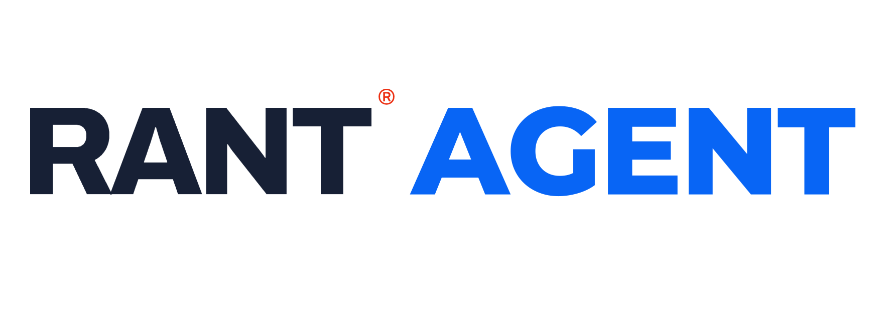

<p align="center"><picture><source media="(prefers-color-scheme: dark)" srcset="sever-ide/public/brand/rant-agent-dark-transparent.svg"></picture></p>

# Rant Agent

**Your models. Your files. One local workspace.**

An open-source assistant for conversations, project files, browser tasks, images and video. Run a local model or bring your own API connection. Your conversation archive and settings live on your computer.

**Early alpha · MIT · macOS / Linux · English / Русский interface**

[Подробная установка на русском](docs/INSTALL_RU.md) · [English installation](docs/INSTALL.md) · [Media generation](docs/MEDIA.md) · [Roadmap](ROADMAP.md)

## Quick start

Install **Python 3.12+**, **Node.js 22.13+ with npm**, and Git first.

```bash
git clone https://github.com/darkdi/rant-agent.git
cd rant-agent
./start.sh
```

The launcher creates `.venv`, installs base dependencies, builds the interface and opens **http://127.0.0.1:4311**. The first launch requires internet; later launches reuse the installation. No model weights are downloaded automatically. Keep the terminal open; press **Ctrl+C** to stop.

On macOS, `Start-Rant.command` is also available after prerequisites are installed.

## Choose a model

| Option | What to install | Connection |
| --- | --- | --- |
| Ollama | Ollama and a downloaded chat model | `http://127.0.0.1:11434/v1` · no key normally needed |
| LM Studio | LM Studio, a downloaded model, Developer server | `http://127.0.0.1:1234/v1` · no key unless server authentication is enabled |
| Built-in Qwen | Apple Silicon, optional MLX packages and Qwen3.5-9B-4bit weights | Runs inside Rant's local Python environment |
| Your API | Provider account, key and supported model | OpenAI Chat Completions, Responses or Anthropic Messages |

For Ollama, download it from [ollama.com](https://ollama.com/download), open it, then:

```bash
ollama pull qwen3:4b
```

In Rant, click the model name → **Добавить модель** → **Ollama** → **Получить список с сервера**. Choose the downloaded model and save. Ollama is optional; choose any one route above. See the [Ollama quickstart](https://docs.ollama.com/quickstart).

## What works

- Chats and projects, streaming answers, Markdown, light/dark themes and local history.
- User-owned API connections; saved keys are excluded from source control.
- Built-in Qwen on Apple Silicon, plus local servers such as Ollama and LM Studio.
- Files and code workspace: read, edit, inspect diffs, preview static pages and undo recorded changes.
- Chrome extension: opt-in page reading, navigation and form interaction.
- Image and video studio: separate user-owned Images API / Replicate / local ComfyUI connections, background jobs and local downloads.
- Text/PDF/image attachments, project notes, experimental context compaction, and selected MCP Streamable HTTP tools.

## Know the limits

This is an **alpha for individual local use**, not a production multi-user service or a full IDE. There is no general shell, terminal, SSH, automatic deployment or code execution environment. File edits are intentionally bounded (currently 24 KB per text file and 100 indexed files). Native Windows is not supported; WSL has not been validated.

The interface is currently Russian. Browser actions and tool use depend heavily on the selected model and website. Built-in Qwen is text-only in this runtime. Image and video generation need their own model/server; an LLM chat connection cannot generate media by itself. See [media setup and validation limits](docs/MEDIA.md).

“Local” describes where the application runs. API providers receive the prompts, attachments and enabled tool results you send them. Remote MCP and browser workflows can access external services. Saved keys are local files with restrictive permissions, **not encrypted storage**. Never expose this server to the internet. Read [SECURITY.md](SECURITY.md).

## Development

```bash
.venv/bin/python -m unittest discover -s sever-ide/backend -p 'test_*.py'
cd sever-ide
npm ci
npm run typecheck
npm run build
```

Python serves the static build and the local API. Node.js is needed for installation/build; it is not a required long-running server. Rebuild with `./start.sh --rebuild` after frontend changes. Alternative ports: `./start.sh --port 4321 --preview-port 4322`.

The Chrome bridge chooses and remembers free ports for this installation. Separate copies use separate extension configuration; they do not inherit each other's token. [Browser setup](docs/INSTALL_RU.md#chrome).

## Contribute

Try one real task, report the model and reproduction steps, or improve the first-run experience. See [CONTRIBUTING.md](CONTRIBUTING.md), [ROADMAP.md](ROADMAP.md) and the [issue tracker](https://github.com/darkdi/rant-agent/issues). Please never attach API keys, private chats or `.local` folders to issues.

## License

Rant Agent source is [MIT licensed](LICENSE). Dependencies and model weights retain their own licenses. Model weights are not included. Generated content is subject to the model/provider terms; no rights or output quality are guaranteed by this project.

## Browser, desktop and MCP connectors

[Chrome, Rant Connect Local and MCP — setup guide](docs/CONNECTORS.md). Personal connector archives are available in **Инструменты и приложения**. Desktop control requires a vision/tool-capable model and explicit activation in the visible companion window.

## Interface language

English is the default. Use **EN / RU** in the top bar to switch instantly; your choice is saved in this browser. Chat messages, project names and file contents are not translated. Offline help is available in both languages.
